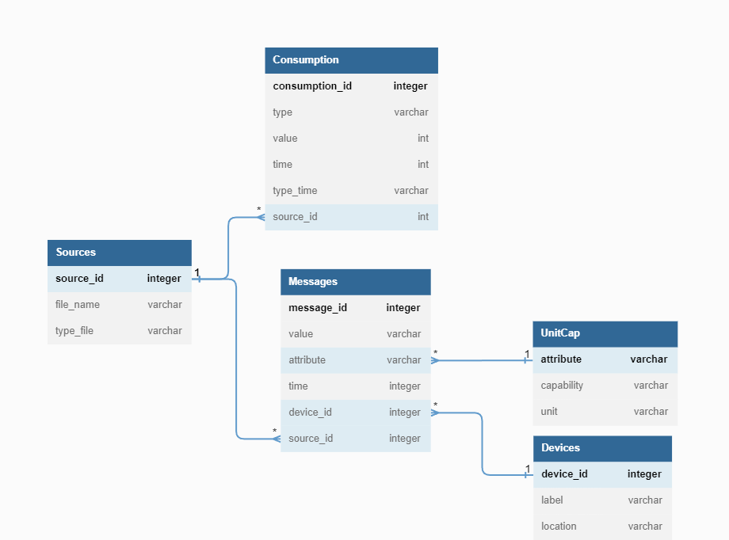

# EfDS: Group assignment of group 7
This is the group assingment of group 7 for the course "Essentials of Data Science" https://github.com/LUMC/EfDS.
Group members are:
- Claudia Grosser
- Marieme Mbaye
- Mikdad Kanbar
- Remco Havermans
- Sybil Liu
- Thi Kim Oanh Nguyen

## Table of Content
1. [Description of the project](#description )
1. [Structure of the project](#structure)
2. [Usage of tools](#usage)
3. [Notes](#notes)

# Description of the project <a name="description"></a>

## Goal
The project's context revolves around energy efficiency in homes, where individuals aim to measure and control device energy usage. The dataset consists of messages generated by approximately 30 smart home devices over a period of 13 months. These devices include sockets, switches, light bulbs, sensors, and more, generating over 1000 daily messages about their state. 
The data comes from a single-family, gas-heated home in Noordwijk, NL. Additionally, we have data on the energy consumption of this family.

By combining the data on device states and energy consumption, we can develop a holistic understanding of energy usage in the home and explore ways to promote sustainable energy practices.

To accomplish this, we first created a database using SQLAlchemy to store the aforementioned data. Next, we developed tools that facilitate communication with the database, enabling us to efficiently store the data within it. Finally, we conducted data analysis and generated reports to gain insights from the collected data.

## Reports 
We have created four reports as part of our project:

1. "temp_energy" Report: In this report, our objective was to analyze the energy consumption of the household and identify the factors that can influence it, such as temperature, duration of usage, and other relevant factors. By examining the correlation between energy consumption and these factors, we aimed to uncover insights into how temperature variations and usage patterns impact energy usage.

2. "predicting_behaviour" report: In this report, our object is to see if there are behaviours to be found in the messages from the smart home devices. We will set out to use classification techniques to determine if patterns can be found. Besides advanced classification techniques, we will also look at patterns of the sensors themselves, and summarise their statistics. All to see if behavioural patterns can be found. 

3. "daily_usage" report: In this report, we analyze the energy and gas usage patterns of this house, where electricity and gas usage are collected biweekly with a 15-minute resolution. The report aims to answer three questions regarding the distribution of energy and gas usage over the day, weekly and seasonal patterns in energy and gas usage, and the identification of time intervals when nobody is at home. 

4. "smartthings" report: The report aims to analyze the daily usage of lights in the living room and to spot any patterns in accordance with months/ seasons. Moreover, we wanted to see if there is any association between lights usage and rainfalls.

# Structure of the project <a name="structure"></a>
## Structure of the files
In order to organise the code well, we structured the respository into different folders.
The folders include the following:
- assignment_info: the organisatorical files, i.e. the task description, the ssh assignment generation and the first group notes
- data: the folder containing the data
- images: used to store images used for the README
- reports: the folder containing the reports
- tools: the folder containing the python scripts for the reports


## File contribution
The following shows who contributed to which tool and files:

X = contribution

o = very little contribution

| Files Names           | Claudia   | Marieme   | Mikdad    | Remco | Sybil | Thi Kim Oanh  |
| ---                   | :---:     | :---:   | :---:       | :---: | :---: | :---:         |
| README                | X         | X         | X         | X     | X     | X             |
| **tools**
| create_database       | o         | o         |           | X     |       |               |
| home_message_db       | X         | X         | X         | X     | X     | X             |
| p1e                   |           | X         |           |       | X     |               |
| p1g                   |           | X         |           |       |       | X             |
| smartthings           | X         |           | X         |       |       |               |
| utils                 | X         | X         | X         |       |       |               |
| openweather           |           | X         |           |       |       |               |
| **reports**
| report_daily_usage    |           |           |           |       | X     | X             |
| report_smartthings    | X         |           | X         |       |       |               |
| report_pred_behaviour |           |           |           | X     |       |               |
| report_temp_energy    |           | X         |           | X     |       |               |
## Structure of the database

In our database, we have decided to store information in the following manner:

1. Sources: This table contains information related to the registered files. Whenever a file is stored in the database, its name (file_name) and type (type_file, e.g., csv, tsv, etc.) are stored.

2. Consumption: This table contains all the data regarding energy consumption. The "type" column corresponds to the type of energy (electricity or gas), the "value" column corresponds to the consumption value at a given time ("time"). The "type_time" variable describes whether the time is during "high" or "low" cost hours. This table is linked to the "Sources" table by storing the identifier of the file from which the data originated.

3. Messages: This table contains all the messages from the home devices. The "value" column contains the message, and the "attribute" column specifies the measured element.

4. Devices: This table stores information related to home devices, including their name ("label") and location ("location").

5. UnitCap: This table is used to store information derived from the "attribute" column, specifically the exact name and unit of measurement for each attribute.

All "time" values are stored in Unix format. The ids are generated automatically by auto incrementation. The device ids were already given.

The image shows how the tables in the database are structured.



We have decided not to store weather data in the database. Instead, we have created a [file](tools/openweather.py) where we retrieve the data and transform it into a suitable format in different dataframes. Therefore, you can simply retrieve the table from this file.

# Usage of tools <a name="usage"></a>
The command line tools should be executed in top level folder of this respository. We provide commands using the command `python3`. In case it does not work, try with `python`.

## Initialize dataset
Initialize the database by running the following code. This is required in order to make use of the tools to insert data into the database.

```bash
python3 tools/create_database.py myhome.db
```

## Smartthings tool
Make sure that the .tsv files for smartthings is store at 'data/smartthings/' and that the database is initialized. In order to insert a single file of the smartthingsLog, you can use the following command (here, the name of the file is `smartthingsLog.2023-01-30_15_25_47.tsv`):

```bash
python3 tools/smartthings.py -d sqlite:///myhome.db smartthingsLog.2023-01-30_15_25_47.tsv
```

In order to insert all file within the data/smartthings/ folder, you can run the following command.

```bash
python3 tools/smartthings.py -d sqlite:///myhome.db smartthingsLog.*.tsv
```

Note that this will take a while (approximately 5 minutes, though also depending on your device).

## P1e tool
In order to insert a single file of the p1e, you can use the following command (here, the name of the file is `P1e-2022-09-01-2022-10-19.csv.gz`):
```bash
python3 tools/p1e.py -d sqlite:///myhome.db P1e-2022-09-01-2022-10-19.csv.gz
```
In order to insert all file within the data/p1e/ folder, you can run the following command.
```bash
python3 tools/p1e.py -d sqlite:///myhome.db P1e-*.csv.gz
```

## P1g tool 
In order to insert a single file of the p1g, you can use the following command (here, the name of the file is `P1g-2022-01-01-2022-09-22.csv.gz`):
 ```bash
python3 tools/p1g.py -d sqlite:///myhome.db P1g-2022-01-01-2022-09-22.csv.gz
```

In order to insert all file within the data/p1e/ folder, you can run the following command.
 ```bash
python3 tools/p1g.py -d sqlite:///myhome.db P1g-*.csv.gz
```
Please don't forget to add the file format at the end.

To have informations about how to use the tools, you can also use the option -h just as follows : 
```bash
python3 tools/p1g.py -h
```
or 
```bash
python3 tools/p1g.py --help
```

# Notes <a name="notes"></a>
A short note on the quality of the data: The data is taken form files provided. These files are provided in the `data/` folder. However, the files contain duplicates, furthermore even many duplicates across the files. In order to prevent storing these duplicates multiple time, a database is created. Before data is inserted, it will be checked, whether a certain is already contained. If so, this data won't be inserted anymore.

Furthermore, each messages containes information about the type of messurement and its unity. Also, for each device, not only its id, but also its location is stored multiple times. These information are redundant for several rows. To overcome this issue, these columns from the original message files have been excluded and are now store in extra tables in order to optimize redudant information and reduce data storage.

